<<<<<<< Updated upstream
## umbc accessibility gps
Official repository for the umbc accesibility gps, a Fall 2025 project for CMSC 447 

## Team: Aidan Denham, Ethan Michalik, Celestine Sumah, Alex Marbut
=======
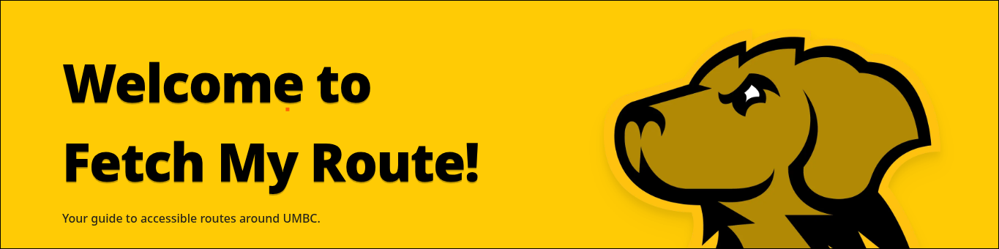
[](https://github.com/pairOfPants/fetch-my-route) [](https://nextjs.org/) [](https://reactjs.org/)[](https://firebase.google.com/)[](https://leafletjs.com/)
[](https://tailwindcss.com/)[](https://nodejs.org/)[](https://www.w3.org/WAI/WCAG21/quickref/)
[](https://umbc.edu/)

# Fetch My Route!
#### Your guide to accessible routes around UMBC 


## 📋 Table of Contents
- [📖 Project Description](#project-description)
  - [Abstract](#abstract)
  - [Purpose](#purpose)
  - [✨ Features](#features)
  - [🛠️ Technologies Used](#technologies-used)
- [📚 Helpful Documentation](#helpful-documentation)
  - [📊 Use Case Diagram](#use-case-diagram)
  - [🗄️ Entity Relationship Diagram](#entity-relationship-diagram)
  - [📄 High Level Documentation](#high-level-documentation)
  - [🚀 Sprint Progress](#sprint-progress)
- [🚀 How to Run the Project](#how-to-run-the-project)
  - [🏠 How to run locally](#how-to-run-locally)
    - [1️⃣ Install all required dependencies](#1-install-all-required-dependencies)
      - [📦 Dependency List](#dependency-list)
    - [2️⃣ Running the project](#2-running-the-project)
  - [☁️ How to deploy](#how-to-deploy)
    - [1️⃣ Install all required dependencies](#1-install-all-required-dependencies-1)
    - [2️⃣ Build the Project](#2-build-the-project)
    - [3️⃣ Firebase Deployment](#3-firebase-deployment)
- [📱 How to Use the Project](#how-to-use-the-project)
  - [👤 Navigation as a Guest](#navigation-as-a-guest)
  - [🎓 Navigation as an Official User](#navigation-as-an-official-user)
  - [⚙️ Navigation as an Admin](#navigation-as-an-admin)
  - [📱 Navigation on Mobile](#navigation-on-mobile)
- [🔮 Future Improvements](#future-improvements)
- [👥 Credits](#credits)
- [⚖️ License](#license)

## 📖 Project Description
#### Abstract
The University of Maryland, Baltimore County, is a public university with a student body of 15 thousand undergraduates (est 2023), and a subset of those students have mobility impairments. While UMBC is an inclusive campus, providing alternate transportation routes for such students, the location of said alternate routes may not be inherently obvious. There exist online maps of the campus for incoming students to plan their routes across the university, as well as guideposts throughout campus, but none highlight the aforementioned alternate routes. 
#### Purpose:
Our project does not reinvent the wheel and utilizes existing technology to provide a map of the UMBC campus, with the target audience being those with mobility impairments. The end result will be in the form of a web application, meaning that (assuming UMBC adopts and hosts our project) anyone will be able to look up our map and find their way around using a cellphone. While the target audience is students unable to use normal routes on campus, our website will be accessible by every student at UMBC. 
	
Although there are existing paper maps of nonstandard routes, procured by the Department of Student Disability Services, there are not enough for every student, and some may get lost. Our solution allows for anyone to access easy navigation through UMBC with nothing but a cell phone and network connection.

#### ✨ Features
* Realtime location updated based on custom-made map
* Navigation inside campus buildings
* Estimated time arrival (ETA) for proper timing
* Directions sent to user and updated in realtime
* Easy to Navigate User Interface
* Administrative Dashboard where routes can be added, edited, and deleted in realtime on client maps
* In accordance with all proper privacy practices, as stated by the University of Maryland, Baltimore County Privacy Policy

#### 🛠️ Technologies Used
* Google OAuth API (for logging in)
* Firebase (database & deployment)
* NodeJs, NextJs, Leaflet (UI)
* OpenStreetMap (For rendering the map data)
* Open Source Routing Machine (for live directions)


### 📚 Helpful Documentation
#### Use Case Diagram


### 🗄️ Entity Relationship Diagram


### 📄 High Level Documentation
*These documents show how the system works at a high level. The most comprehensive of all documentation, as well as your first source for questions, is the SRS document. For more specific questions regarding one specific component of this project, additional resources can be found below the SRS.* 

SRS Document: **Will upload when final SRS is finalized**

System Design Document: [HERE](./assets/System%20Design%20Document.pdf)

User Interface Design Document: [HERE](./assets/User%20Interface%20Design%20Document.pdf)

Testing Document: [HERE](./assets/Software%20Testing%20Document.pdf)

### 🚀 Sprint Progress
*These Documents show less of the final product's functionality, and instead are a testament of how Fetch My Route! was created from the ground up. Therefore, view these documents not as "how to's" or sources of information, but instead as monthly updates which improve over time.*

Project Proposal Document: [HERE](./assets/Project%20Proposal%20Document.pdf)

Sprint Report 1: [HERE](./assets/Sprint%201%20Report.pdf)

Sprint Report 2: [HERE](./assets/Sprint%202%20Report.pdf)

Sprint Report 3: **Will upload at the conclusion of Sprint 3**


## 🚀 How to Run the Project
Fetch my Route features 2 main methods of running the project. One can either run it locally or deploy the website to the internet. See below for appropriate instructions depending on use case.
### 🏠 How to run locally
In order to get this project set up and working on your device, there are a few steps that must be taken. Given more time to develop this project, it is a goal to automate this process, however no such automation exists yet for this project. With that being said, follow these steps and you should be fine. These steps should be completed after cloning the repository
#### 1️⃣ Install all required dependencies
##### 📦 Dependency List
There exists a file in this repository called dependencies.txt, which has all dependency information listed there. For convenience, I will also show the file contents below:

├── @emnapi/runtime@1.7.1 extraneous

├── autoprefixer@10.4.21

├── eslint-config-next@15.5.6

├── eslint@8.57.1

├── firebase@12.6.0

├── framer-motion@11.18.2

├── leaflet-geometryutil@0.10.3

├── leaflet-polylinedecorator@1.6.0

├── leaflet@1.9.4

├── lucide-react@0.452.0

├── next@15.5.7

├── postcss@8.5.6

├── react-dom@18.3.1

├── react@18.3.1

└── tailwindcss@3.4.18


Similar to any npm project, there are two main commands to install all of these dependencies automatically. The first, is 
```js
npm install
```

and this command reads package.json and installs everything listed. This is the standard way and what you should use. However, if you want to preserve the exact versions of each dependency, the proper command to use is 
```js
npm ci
```
This uses package-lock.json to install exact versions from last successful install. More reliable than npm install for reproducibility.

#### 2️⃣ Running the project
Once all dependencies are installed, spinning up the local server is as simple as running the command:
```js
npm run dev
```
Then, in a local broswer, navigate to port 3000 on localhost. You should see the website.

**Please note that the root directory for all npm commands is located at ```./front\ end/``` so running the above commands outside that directory will result in errors.**

### ☁️ How to deploy
Due to the limited time circumstances faced in developing this project, this project was deployed using Firebase's website deployment feature. For a more permanent home, it is advices that a domian is officially purchased and hosted through a more reputable source, such as CloudFlare. With that being said, below are the instructions to get it working on firebase, assuming you have the necessary database files (which do not come with this project as that violates the UMBC Privacy Policy). These steps should be done after cloning this repo.

#### 1️⃣ Install all required dependencies
See [How to run locally](#how-to-run-locally) for these instructions

#### 2️⃣ Build the Project
After configuring npm for this project, you can perform a full build by running the command
```js
npm run build
```

This allows us to move to step 3.
#### 3️⃣ Firebase Deployment
Again, this step assumes the firebase project exists and the database is correctly configured. No help can be offered with this, but if you need to create the DB from scratch, the ER diagram is provided above. Then, you must install firebase and firebase-admin
```js
npm install firebase firebase-admin
```
and then log into your account using
```js
firebase login
```
finally, run the following two commands to deploy the project (note the first command need only be run once, while the latter needs to be run before seeing updates on every new build)

```js
firebase experiments:enable webframeworks
firebase deploy
```


## 📱 How to Use the Project
This next section comprehensively describes how to use Fetch My Route! and highlights all core features. To avoid an overly-verbose README, I will try to keep explanations brief as the User-Interface is intentionally designed to be familiar to users who have used navigation software before (Google Maps, Waze, Apple Maps, etc.). 

The first screen the user is greeted with is the splash screen, where users can log in with an email address or continue to view the site as a guest. If they choose to log in, anyone with a valid UMBC email address (students and faculty) already has an account created for them. Just log in with google and you are good to go. If you do not have a UMBC email address, then certain functionality of this website are off-limits (indoor navigation, saving routes) due to their inclusion violating the University's Privacy Policy. After either logging in or continuing as a guest, the next screen the user will face is the main routing screen. Functionality differs on this screen based on the user's status.
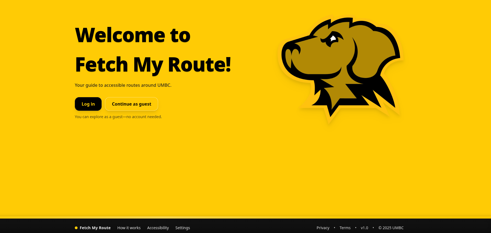

### 👤 Navigation as a Guest
If the user continues as a guest, they have access to the majority of core funcionality and can view the exterior map, find routes, and search for campus buildings. 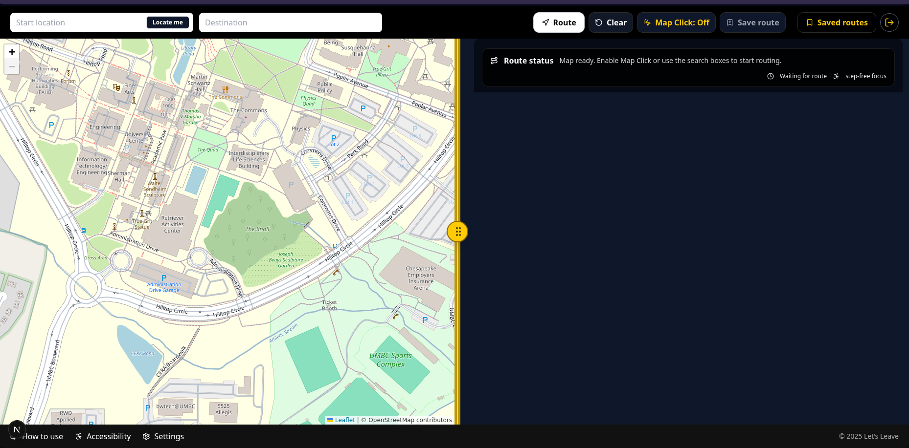 The user can utilize the split screen mechanic by hovering their mouse over the yellow circular button, which then allows the user to snap the view to just one screen, or reset the view to the default (seen above). The users can search for campus buildings either one of three ways:
1. Typing in start and end buildings using the smart search bars
2. Toggling the *Map Click* button allows the users to select start/end locations by clicking
3. The user can hit the *Locate Me* button in the *Start Location* Text Input Field to have the starting location be their current location. 

Once a route is selected, the closest route between the start and end nodes should be drawn to the screen. If it is not, hitting the *Route* button will draw it. For example, if I want to walk from the **Performing Arts & Humanities Building** to **The Commons**, the route would look like this
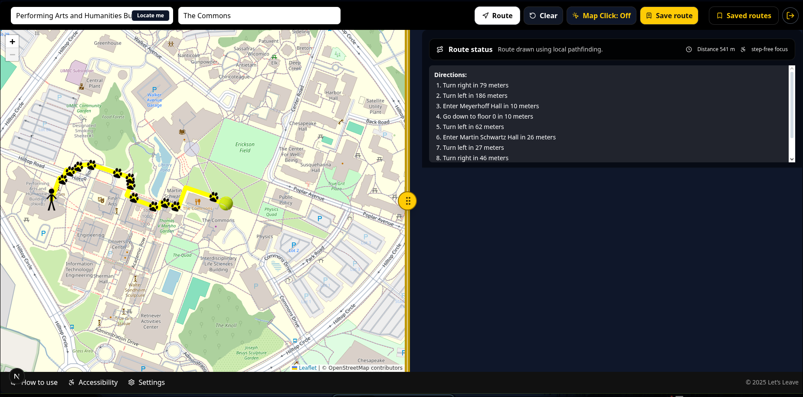

As you may have noticed, the directions have also appeared on the right panel. Since, as per the mission statement, stairs are off limits, the routing engine will take the user through campus buildings and elevators instead. 

Visually, the person is throwing the ball from the start building to the end building, and in a future iteration of this project there will be a dog icon representing the user's current location on the map. This data is still stored, but it is not represented on the map. The directiond do update according to the user's location, however. 

If a user tries to save this route by hitting the *Save Route* button, they are able to do so. However, they cannot view any saved routes, as that is only available to users who are logged in.

Finally, to clear the screen after a route is completed, the user can hit the *Clear* button and the map will reset to its default state. 

### 🎓 Navigation as an Official User
All guest functioanlity is available to logged in users, so reading the above section is necessary. The main differences are that a logged in user can save/load routes across devices, and (eventually) the logged-in users will be able to view floorplan data if they are stuck navigating inside a building. The User Interface is also slighyly different, as there is an indicator that you are logged in on the top right of the screen. 

Here is the sequence of displayes a logged-in user will come across when they load a saved route:
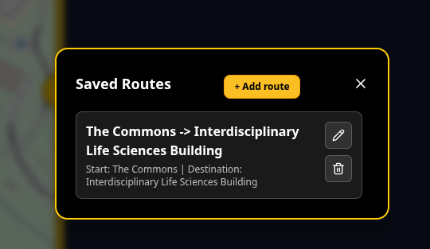 
--> Click on the rotue --> 
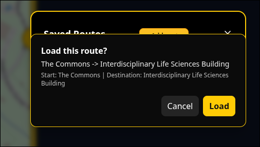
--> Click *Load* --> Click the *Route* button -->
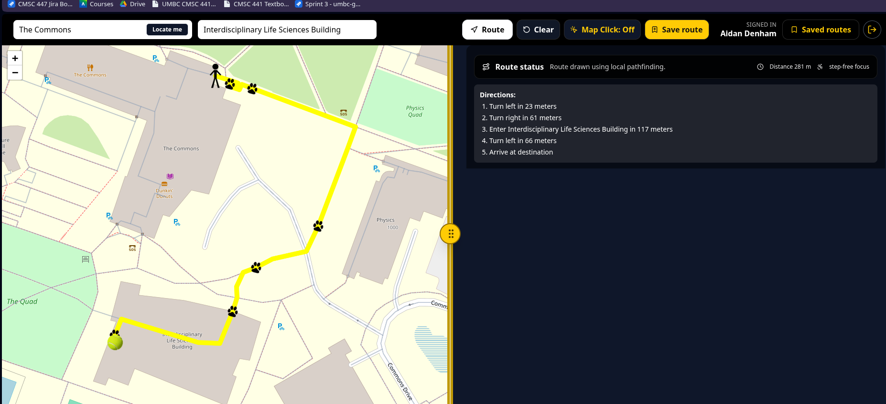

And proceed with the route as normal.
### ⚙️ Navigation as an Admin
**It is essential to note that none of the User Interface design choices in the following screens are permanent, or even polished. With our group's deadline approaching, we chose to prioritize functionality over style. If given the ability to continue this project, these screens would be changed *drastically***

As an administrator, you are granted access to the Map Editor page, where the admin has a graphical way to add new routes, edit existing routes, or remove a route altogether. In this sense, I am defining the term route not as a complete guide from start to end, but as any given segment or set of segments that the user can navigate along. However, the first thing the administrator sees after logging in is a simple dashboard, presenting them with all of their options.
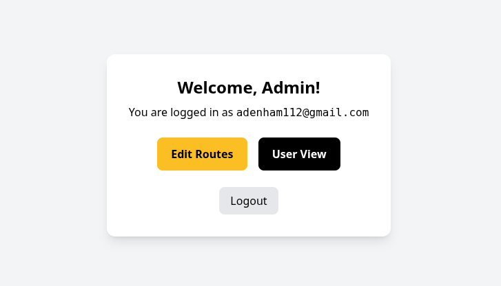

If the admin clicks *Logout*, they will return to the splash screen. If they click *User View* they are directed to the Map screen, with a new *Edit Routes* button on the top bar. Clicking the *Edit Routes* button brings the user to the same page as if they hit the *Edit Routes* on the main dashboard.
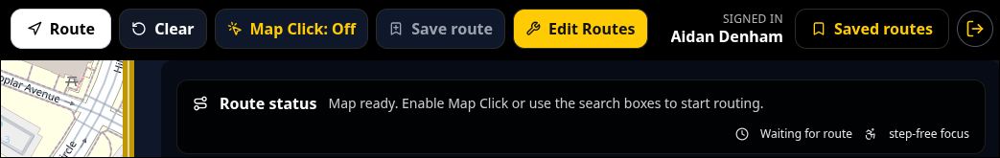


Finally, if the admin clicks the *Edit Route* button they are greeted with another map of the campus, but this time it is interactable. The user can click on either the *Add Segment* button, or any existing segment to edit or delete it. 
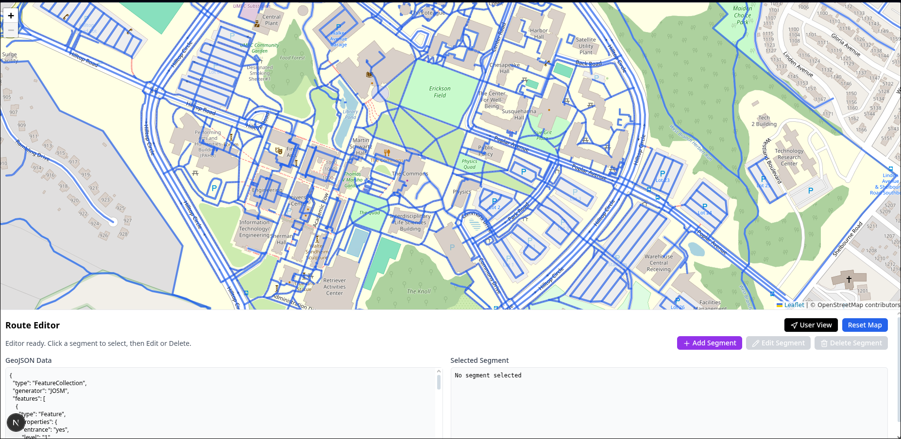

If the user clicks on a segment, it will highlight in yellow and the user then unlocks the option to edit or delete the segment. 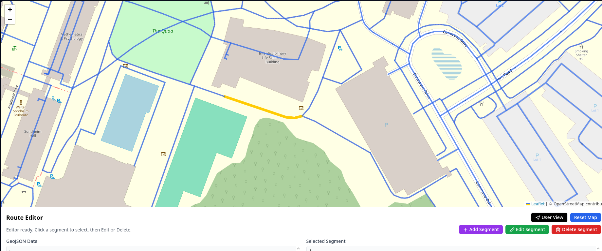 Deleting the segment functions as one would imagine. Editing the route grants you control over any of the verticies that make up that segment, and the user can drag them across the map as they see fit. Adding a segment will allow the user to click on the map to create verticies, creating as many verticies as they see fit, then when the admin is done drawing they can review their changes (apply edits to the newly drawn route). Finally, the Admin will then save the changes by hitting the *Save Segment* button and it will write the new rotue to the database, where all users will see it upon reloading their tab.

*It is important to understand that any changes the Administrator makes to the map will be visible to all guests and normal accounts. If they make a mistake, hitting the **Reset Map** button will reset any changes made back to the base map of campus.*

### 📱 Navigation on Mobile 
**Similar to the Admin pages, the user interface on mobile has scaling issues and is generally not the smoothest user experience. The priority was to show a working prototype and mobile UI refinement is one of the biggest ToDo's for this project, if we are given a future.**

Navigating the mobile site is similar to navigation on a computer, but the horizontal scrollbar has its orientation switched to vertical, to better allign with a phone's screen resolution. All other components of navigation are similar to the desktop experience.

## 🔮 Future Improvements
While the core functionality of the system is intact, there are still a number of bugs to squash and features that would elevate this project from a mere proof-of-concept to a deployable, usable, scalable feature of the UMBC digital infrastructure. Below is a non-exhaustive list of future improvements that would be made to this project, if it were selected by our stakeholders to be adopted by UMBC.

1. Add dog icon as live-location marker
    1.1 Optional: PawPrints only behind dog
2. Give the person an outline so the icon stands out more
3. User cannot save routes if they used "Map Click" to generate it
4. General Scaling needs to be improved on mobile devices
5. NextJS error upon runtime - Map already initialized error
6. Website has some latency on older mobile devices
7. Live location does not work on Linux (may not be an issue)
8. PawPrints are not spaced at regular intervals
9. High Contrast could have higher contrast
10. Many buttons all over webpage - consolidate buttons
11. Users can report blocked routes and send an email notification to Admin with said route outage


## 👥 Credits
##### Meet the Team:
Aidan Denham, [@pairOfPants](https://github.com/pairOfPants)

Alex Marbut, @

Celestine Sumah, @ 

Ethan Michalik @


These four developers have put in exceptional effort to complete this project in a timely manner. The advising UMBC professor on this project, Dr. Samit Shivadekar, may or may not have said 
*"This group went above-and-beyond, exceeded all requirements, and any employers reading this should hire all four of these developers right now!"*

## ⚖️ License
At this point in time, this project is unlicensed. If the University of Maryland, Baltimore County decides to adopt this project, this fact will inevitably change.
>>>>>>> Stashed changes

## Tech Stack
- Next.js (React)
- Tailwind CSS (styles)

## Problem Statement
- (will complete later)
